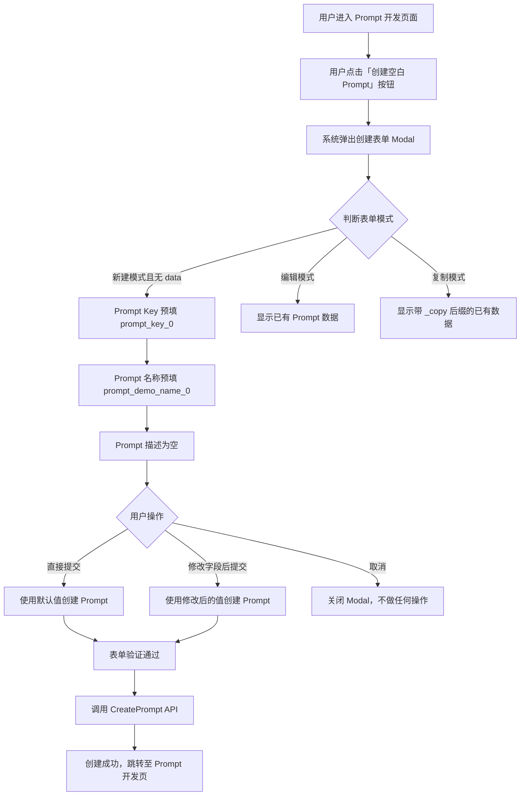

# 功能规格说明书：Prompt 创建表单预填默认值

## 文档信息

| 属性 | 值 |
|------|------|
| 版本 | 1.0 |
| 状态 | 草稿 |
| 来源 PRD | prd.md |

---

## 1. 功能概述

在 Prompt 开发页面，用户点击「创建空白 Prompt」后弹出的创建表单（`PromptCreateModal`）中，为 Prompt Key 和 Prompt 名称两个字段预填默认值，减少用户手动输入操作，提升创建效率。

---

## 2. 用户故事

| ID | 角色 | 故事 | 验收标准 |
|----|------|------|----------|
| US-001 | Prompt 开发者 | 我希望点击「创建空白 Prompt」后，表单中的 Prompt Key 和 Prompt 名称字段已预填默认值，以便我可以快速创建 Prompt 而无需手动填写 | 表单弹出时 Prompt Key 显示 `prompt_key_0`，Prompt 名称显示 `prompt_demo_name_0` |
| US-002 | Prompt 开发者 | 我希望预填的默认值可以自由修改，以便我可以按实际需求自定义 Prompt Key 和名称 | 用户可以清除并修改预填的默认值，修改后的值能正常通过表单验证并提交 |
| US-003 | Prompt 开发者 | 我希望预填默认值不影响已有的编辑、复制等表单行为，以便其他功能保持正常 | 编辑模式下显示已有数据而非默认值；复制模式下显示带 `_copy` 后缀的已有数据而非默认值 |

---

## 3. 交互流程



---

## 4. 验收场景

```markmap
# Prompt 创建表单预填默认值

## 新建模式
### 默认值展示
- Prompt Key 显示 `prompt_key_0`
- Prompt 名称显示 `prompt_demo_name_0`
- Prompt 描述为空

### 默认值可修改
- 用户可清除 Prompt Key 并输入新值
- 用户可清除 Prompt 名称并输入新值
- 修改后仍能通过表单验证

### 默认值可直接提交
- 不修改直接点击确认，使用默认值成功创建

## 编辑模式
### 不受默认值影响
- Prompt Key 显示已有值（非默认值）
- Prompt 名称显示已有值（非默认值）

## 复制模式
### 不受默认值影响
- Prompt Key 显示已有值 + `_copy` 后缀
- Prompt 名称显示已有值 + `_copy` 后缀

## 表单验证
### 默认值符合校验规则
- `prompt_key_0` 满足 `^[a-zA-Z][a-zA-Z0-9_.]*$` 正则
- `prompt_demo_name_0` 满足 `^[\u4e00-\u9fa5a-zA-Z0-9_.-]+$` 正则且不以 `_.-` 开头
```

---

## 5. 功能需求

### FR-001：新建模式下 Prompt Key 预填默认值

**描述**：当用户以新建模式（非编辑、非复制）打开创建表单时，Prompt Key 字段应预填默认值 `prompt_key_0`。

**前置条件**：
- 用户点击「创建空白 Prompt」按钮
- 表单以新建模式打开（`isEdit=false`，`isCopy=false`，`data` 为空或未传入）

**预期行为**：
- Prompt Key 输入框显示 `prompt_key_0`
- 该值为可编辑状态，用户可自由修改

---

### FR-002：新建模式下 Prompt 名称预填默认值

**描述**：当用户以新建模式打开创建表单时，Prompt 名称字段应预填默认值 `prompt_demo_name_0`。

**前置条件**：
- 用户点击「创建空白 Prompt」按钮
- 表单以新建模式打开（`isEdit=false`，`isCopy=false`，`data` 为空或未传入）

**预期行为**：
- Prompt 名称输入框显示 `prompt_demo_name_0`
- 该值为可编辑状态，用户可自由修改

---

### FR-003：默认值符合表单验证规则

**描述**：预填的默认值必须符合现有的表单验证规则，确保用户不修改默认值时也能直接提交。

**验证规则**：
- Prompt Key (`prompt_key_0`)：满足正则 `^[a-zA-Z][a-zA-Z0-9_.]*$`，长度不超过 100 字符
- Prompt 名称 (`prompt_demo_name_0`)：满足正则 `^[\u4e00-\u9fa5a-zA-Z0-9_.-]+$`，不以 `_.-` 开头，长度不超过 100 字符

**预期行为**：
- 使用默认值直接提交时，表单验证通过，不会出现错误提示

---

### FR-004：编辑模式不受默认值影响

**描述**：当用户以编辑模式打开表单时，表单应显示已有 Prompt 数据，而非默认值。

**前置条件**：
- 表单以编辑模式打开（`isEdit=true`）
- 传入了已有的 Prompt 数据（`data` 包含有效值）

**预期行为**：
- Prompt Key 显示 `data.prompt_key`（即已有值），且为禁用状态（不可修改）
- Prompt 名称显示 `data.prompt_basic.display_name`（即已有值）
- 不显示默认值

---

### FR-005：复制模式不受默认值影响

**描述**：当用户以复制模式打开表单时，表单应显示已有 Prompt 数据加 `_copy` 后缀，而非默认值。

**前置条件**：
- 表单以复制模式打开（`isCopy=true`）
- 传入了已有的 Prompt 数据

**预期行为**：
- Prompt Key 显示 `{data.prompt_key}_copy`（如原 Key 长度 < 95）或 `{data.prompt_key}`（如原 Key 长度 ≥ 95）
- Prompt 名称显示 `{data.prompt_basic.display_name}_copy`（如原名长度 < 95）或 `{data.prompt_basic.display_name}`（如原名长度 ≥ 95）
- 不显示默认值

---

### FR-006：默认值可被用户修改

**描述**：预填的默认值应为可编辑状态，用户可自由修改。

**预期行为**：
- 用户可以选中并清除预填的 Prompt Key，输入自定义值
- 用户可以选中并清除预填的 Prompt 名称，输入自定义值
- 修改后的值按原有验证规则进行校验
- 修改后的值用于 API 调用

---

## 6. 表单规格

### 创建 Prompt 表单（新建模式）

| 字段 | 类型 | 必填 | 默认值 | 最大长度 | 验证规则 | 说明 |
|------|------|------|--------|----------|----------|------|
| Prompt Key | 文本输入 | 是 | `prompt_key_0` | 100 | 正则：`^[a-zA-Z][a-zA-Z0-9_.]*$` | 仅新建模式预填默认值；编辑模式显示已有值且禁用；复制模式显示已有值 + `_copy` |
| Prompt 名称 | 文本输入 | 是 | `prompt_demo_name_0` | 100 | 正则：`^[\u4e00-\u9fa5a-zA-Z0-9_.-]+$`，不可以 `_.-` 开头 | 仅新建模式预填默认值；编辑/复制模式显示已有值 |
| Prompt 描述 | 文本域 | 否 | 空 | 500 | 无特殊规则 | 所有模式均不预填默认值 |

---

## 7. 业务逻辑规则

### BL-001：默认值仅在新建模式下生效

当且仅当以下条件同时满足时，才为字段预填默认值：
- `isEdit` 为 `false`（非编辑模式）
- `isCopy` 为 `false`（非复制模式）
- `data` 为空或未传入（无已有 Prompt 数据）

### BL-002：默认值优先级低于已有数据

当 `data` 中包含 `prompt_key` 或 `prompt_basic.display_name` 时，应使用已有数据而非默认值。已有数据优先级高于默认值。

### BL-003：默认值不影响 Prompt 描述字段

Prompt 描述字段在任何模式下均不预填默认值，保持原有行为不变。

### BL-004：默认值 Key 重复冲突处理

[待澄清: 当用户不修改默认 Prompt Key `prompt_key_0` 直接提交，且该 Key 已被占用时，应如何处理？是依赖后端返回重复错误提示，还是前端需要自动递增后缀（如 `prompt_key_1`）？PRD 未明确此场景。]
