# 前端隐性技术需求分析报告

## 1. 分析概览

### 1.1 需求背景

本次分析针对「Prompt 创建表单预填默认值」功能，即在 `PromptCreateModal` 组件中为新建模式下的 Prompt Key 和 Prompt 名称字段预填默认值（`prompt_key_0` / `prompt_demo_name_0`）。

### 1.2 工程上下文

经过对代码仓库的深入分析，发现以下关键工程事实：

- **存在两套创建组件**：`PromptCreate`（v1，位于 `prompt-components`）和 `PromptCreateModal`（v2，位于 `prompt-components-v2`），两者逻辑高度相似但独立维护
- **多处消费方**：`PromptCreateModal` 在 Prompt 列表页（`prompt-pages/list`）和 Prompt 开发页头部（`prompt-header`）中均被使用
- **v1 组件仍被引用**：`evaluate-components` 的全局配置中引用了 v1 的 `PromptCreate` 组件，并通过依赖注入模式供评测模块使用
- **表单使用 Semi Design 的 Form 组件**：通过 `initValues` 设置初始值，`FormApi` 的 ref 管理表单状态
- **Modal 状态由 `useModalData` hook 管理**：该 hook 管理 `visible` 和 `data` 两个状态，`open(data?)` 时传入数据，`close()` 时清空

### 1.3 涉及的核心组件和文件

| 组件/文件 | 说明 |
|-----------|------|
| `prompt-components-v2/prompt-create-modal` | v2 版本的创建 Modal，主要消费方 |
| `prompt-components/prompt-create` | v1 版本的创建组件，evaluate 模块仍在使用 |
| `prompt-pages/list` | Prompt 列表页，调用 `PromptCreateModal` |
| `prompt-develop/prompt-header` | Prompt 开发页头部，调用 `PromptCreateModal`（编辑/复制/创建） |
| `evaluate-components/eval-global-config` | 评测全局配置，通过依赖注入引用 v1 `PromptCreate` |
| `base-hooks/use-modal-data` | Modal 数据管理 hook |
| `api-schema/prompt/coze.loop.prompt.manage` | API Schema 定义 |

---

## 2. 分层分析结果

### 2.1 页面生命周期分析

#### 2.1.1 Modal 打开时的初始化逻辑

当前 `PromptCreateModal` 使用 `Form` 组件的 `initValues` 来设置表单初始值。关键隐性需求在于：`initValues` 仅在 Form 组件**首次挂载**时生效。如果 Modal 采用"保持 DOM 但控制 visible"的策略（而非每次关闭后卸载），则第二次打开 Modal 时 `initValues` 不会重新应用。

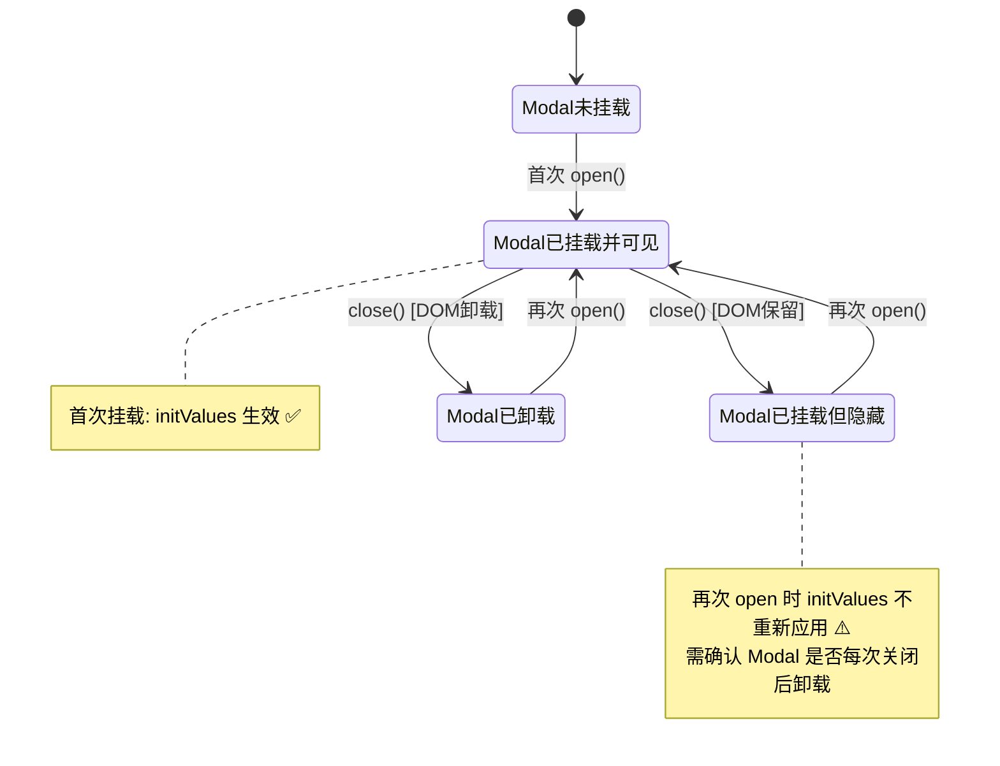

**隐性需求 M-01**：需确认 Semi Design Modal 在 `visible=false` 时是否卸载子组件。如果不卸载，需要在 `visible` 变为 `true` 时手动通过 `formApi.setValues()` 重置表单值，以确保默认值正确预填。

#### 2.1.2 刷新恢复

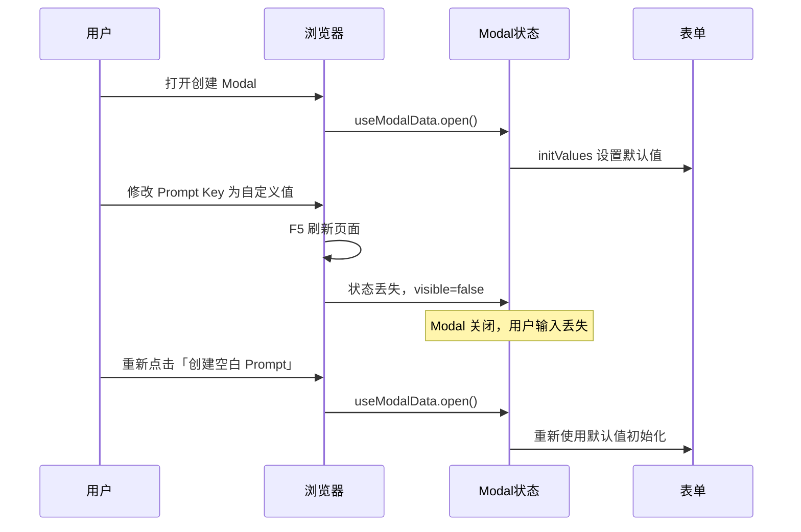

**隐性需求 M-02**：Modal 中的表单状态在页面刷新后不保留（`useModalData` 使用 `useState`，无持久化）。对于此需求，这是**可接受行为**，但需明确文档记录——用户在创建表单中填写的内容不会因刷新而恢复。

#### 2.1.3 退出清理

**隐性需求 M-03**：用户点击取消关闭 Modal 后再次打开时，表单应恢复到默认值状态（而非保留上次编辑的残留值）。需确认 `useModalData.close()` 后表单状态是否彻底清理。

---

### 2.2 组件状态流转分析

#### 2.2.1 表单模式判定状态机

当前 `PromptCreateModal` 通过 `isEdit`、`isCopy`、`data` 三个 Props 的组合来决定表单行为。新增默认值后，状态判定更加复杂：

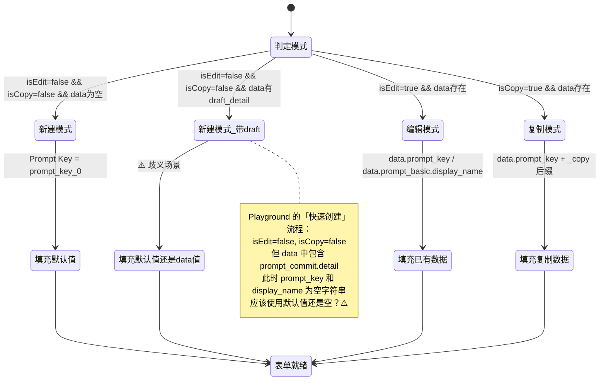

**隐性需求 M-04**：Playground 页面中的「快速创建」按钮会传递一个包含 `prompt_commit.detail`（草稿内容）但 `prompt_key` 和 `display_name` 为空的 `data` 对象。此时 `data?.prompt_key` 是空字符串 `""`（而非 `undefined`），JavaScript 中空字符串是 falsy 值，行为取决于 `initValues` 的处理方式。需明确：**当 `data` 存在但 `prompt_key` 为空字符串时，是否应填入默认值**。

#### 2.2.2 跨组件状态共享风险

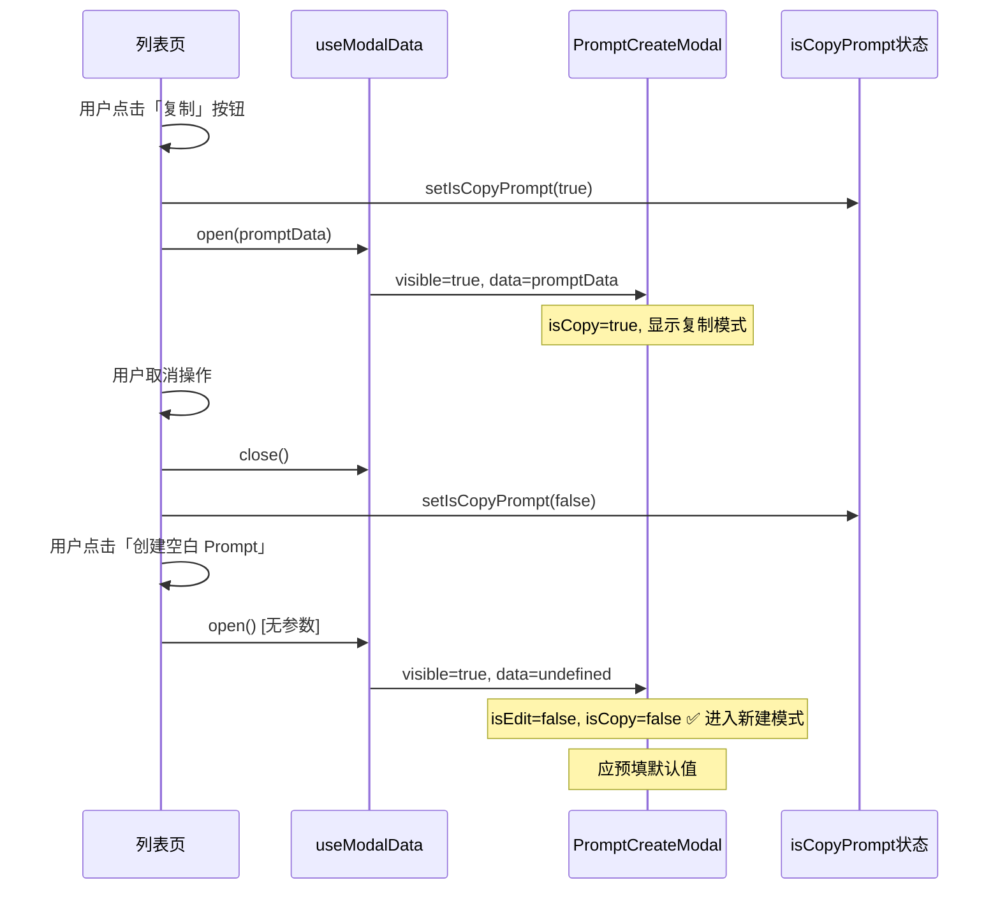

**隐性需求 M-05**：列表页中 `isCopyPrompt` 和 `createModal` 是两个独立的状态。在「复制→取消→创建」的连续操作中，需确保 `isCopyPrompt` 已被正确重置为 `false`，否则新建模式可能被错误识别为复制模式，导致默认值逻辑不触发。当前代码在 `onCancel` 回调中调用了 `setIsCopyPrompt(false)`，但若用户通过点击 Modal 外部区域关闭（且 Modal 的 `onCancel` 未被触发），可能出现状态残留。

#### 2.2.3 v1 与 v2 组件状态一致性

**隐性需求 M-06**：v1 版本的 `PromptCreate` 组件和 v2 版本的 `PromptCreateModal` 组件有相同的表单逻辑但独立维护。如果仅修改 v2 版本添加默认值，v1 版本（被 `evaluate-components` 通过全局配置引用）不会自动获得默认值行为。需确认是否需要同步修改 v1 组件，或评估 evaluate 模块中创建 Prompt 的场景是否需要默认值。

---

### 2.3 用户交互动线分析

#### 2.3.1 默认值与 Prompt Key 唯一性冲突

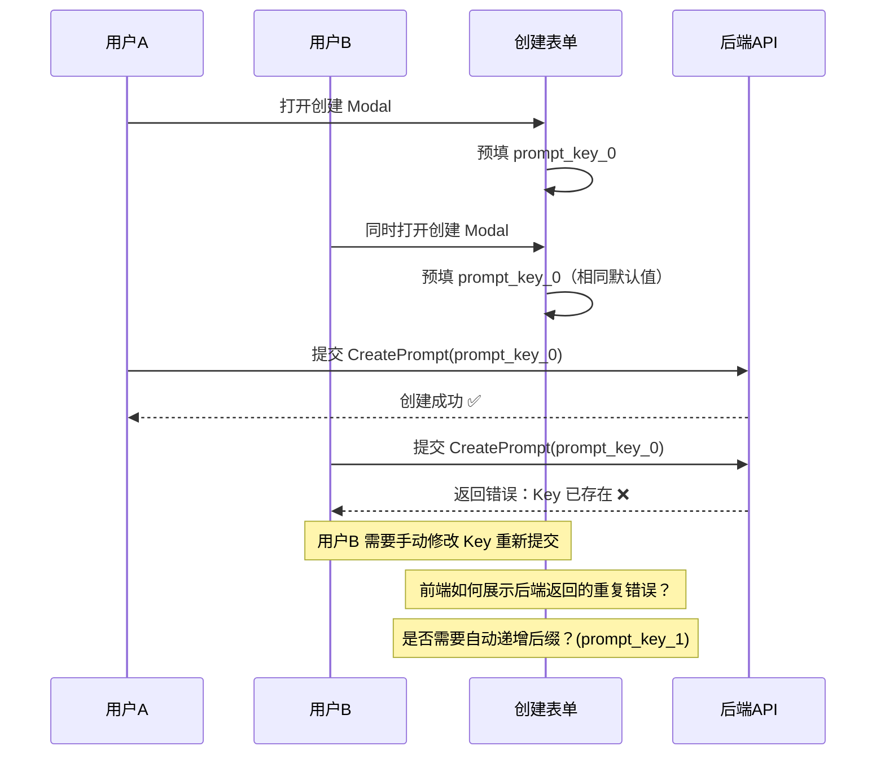

**隐性需求 M-07**（关键）：固定默认值 `prompt_key_0` 在多用户并发场景、以及同一用户第二次使用默认值创建时，几乎必然发生 Key 冲突。需要设计**冲突处理策略**：
1. **方案 A**：前端在提交前请求后端校验 Key 唯一性（增加 API 调用）
2. **方案 B**：后端返回冲突错误时，前端友好地展示错误信息并聚焦到 Prompt Key 输入框
3. **方案 C**：自动生成带递增后缀或随机后缀的 Key（如 `prompt_key_1`、`prompt_key_abc12`）
4. **方案 D**：保持当前行为，依赖后端错误提示

当前 PRD 中标注了「待澄清」但未给出答案，这是上线前必须确定的关键决策点。

#### 2.3.2 提交失败后的表单保持

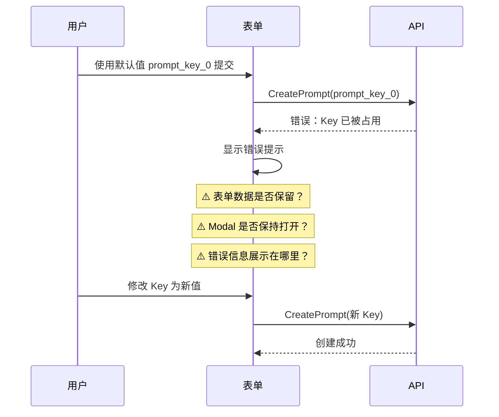

**隐性需求 M-08**：当使用默认值提交失败（Key 冲突或其他错误）时，需确保：
1. Modal 保持打开状态（不自动关闭）
2. 用户已填写的数据（包括描述等其他字段）不丢失
3. 错误信息以 Form 校验提示的形式展示在 Prompt Key 字段下方

当前代码中 `handleOk` 使用 `runAsync` 的 Promise，若发生错误会抛出异常但没有显式的 catch 处理展示错误到表单字段。`useRequest` 的默认行为可能不会将后端错误映射到表单字段级别的校验提示。

#### 2.3.3 Snippet 模式的默认值排除

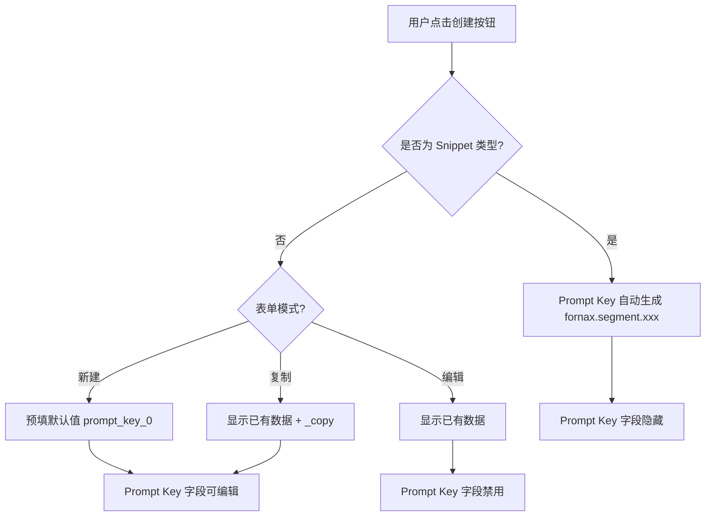

**隐性需求 M-09**：v2 版本的 `PromptCreateModal` 支持 `isSnippet` 属性。当 `isSnippet=true` 时，Prompt Key 由代码自动生成（`fornax.segment.{nanoid}`），且 Prompt Key 输入框被隐藏。**默认值逻辑应在 `isSnippet` 为 true 时跳过**，因为预填值对用户不可见且最终会被覆盖。虽然当前逻辑中 Snippet 模式下 Prompt Key 字段 DOM 不渲染，但 `initValues` 中仍会设置该值，可能产生不必要的内存占用或潜在混淆。

---

### 2.4 数据获取与缓存分析

#### 2.4.1 API 调用与错误处理

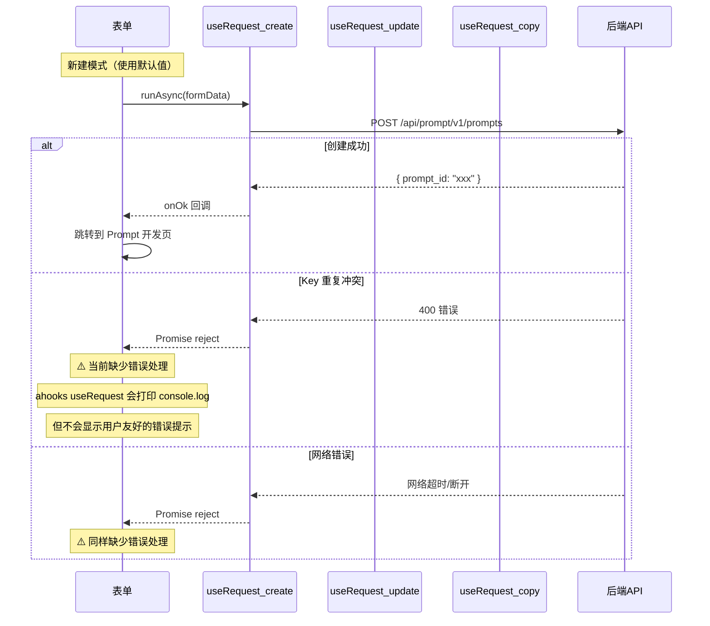

**隐性需求 M-10**：`handleOk` 函数中的 API 调用（`createService.runAsync`）没有 `.catch()` 处理链。`useRequest` 配置为 `manual: true`，失败时 `runAsync` 会 reject Promise，但 `handleOk` 中没有显式的错误处理。当前行为是错误被静默吞掉（或仅在控制台输出）。需要增加错误处理逻辑，特别是针对 Key 重复的场景，向用户展示明确的错误提示。

#### 2.4.2 避免重复提交

**隐性需求 M-11**：当用户使用默认值快速连续点击提交按钮时，可能触发多次 `CreatePrompt` API 调用。当前代码通过按钮的 `loading` 状态（`createService.loading`）来防止重复提交，这是正确的。但需确认在 loading 期间，按钮是否真正被禁用（`loading` 状态是否同时设置 `disabled`）。

#### 2.4.3 表单验证的同步/异步一致性

**隐性需求 M-12**：当前表单验证（正则校验）是纯前端同步校验。默认值 `prompt_key_0` 满足正则 `^[a-zA-Z][a-zA-Z0-9_.]*$`，可以通过前端校验。但 Key 唯一性校验只能在后端完成。需要考虑是否增加**异步表单校验**（在 blur 时请求后端检查 Key 是否已存在），以提供更好的用户体验。

---

### 2.5 组件复用与影响分析 ⭐

#### 2.5.1 双版本组件修改影响矩阵

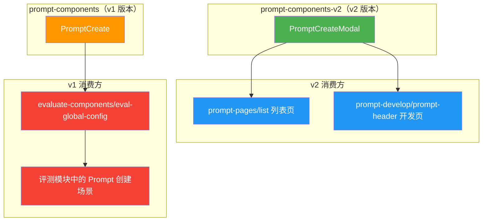

**隐性需求 M-13**（关键）：存在 v1 和 v2 两套独立的 Prompt 创建组件，修改需要评估同步策略：

| 组件 | 位置 | 消费方 | 是否需要添加默认值 |
|------|------|--------|-------------------|
| `PromptCreateModal` (v2) | `prompt-components-v2` | 列表页、开发页 | ✅ 必须 |
| `PromptCreate` (v1) | `prompt-components` | 评测模块（通过全局配置注入） | ⚠️ 待确认 |

如果仅修改 v2 版本，评测模块中的创建场景不会获得默认值行为，这可能导致用户体验不一致。

#### 2.5.2 initValues 计算逻辑的修改方案

当前 `initValues` 的计算逻辑：

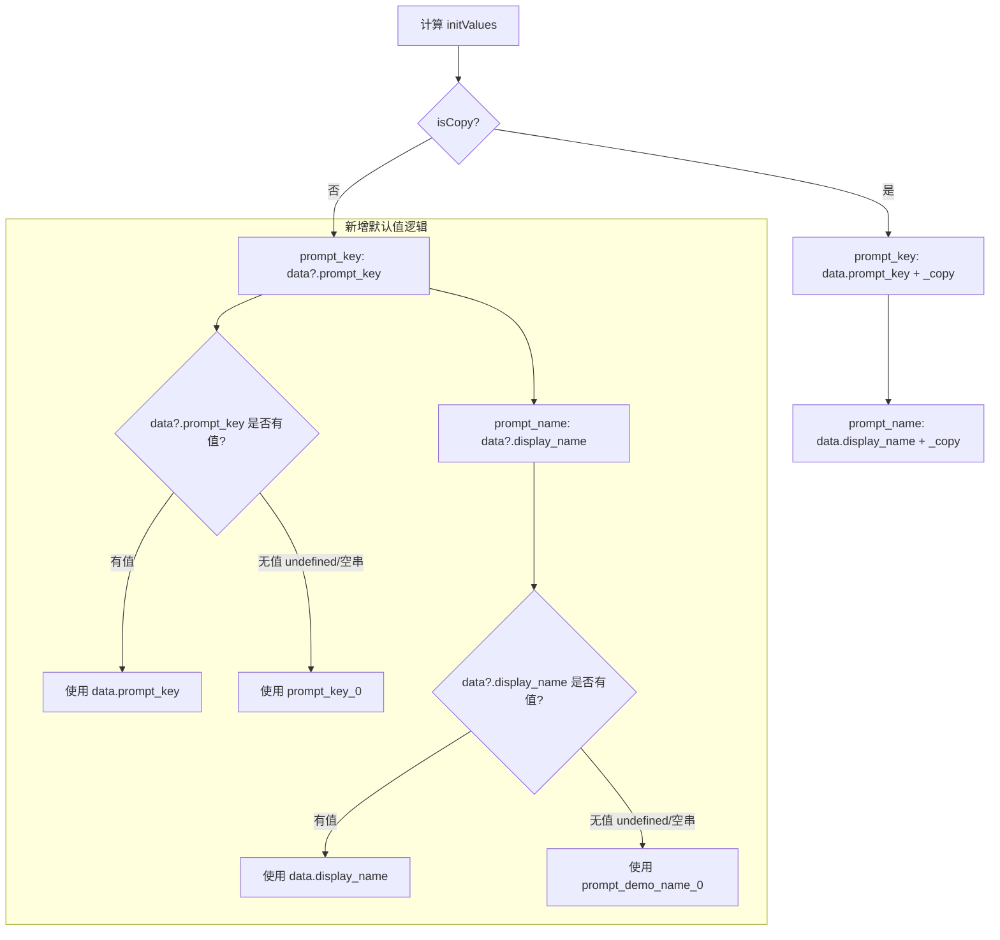

**隐性需求 M-14**：`initValues` 中的默认值兜底逻辑需使用 `||` 运算符（而非 `??`），因为空字符串 `""` 也应被视为"无值"而触发默认值填充。具体来说：
- `data?.prompt_key || 'prompt_key_0'` — 当 `prompt_key` 为 `undefined`、`null` 或 `""` 时均使用默认值
- `data?.prompt_key ?? 'prompt_key_0'` — 当 `prompt_key` 为 `""` 时**不会**使用默认值

这在 Playground 快速创建场景中尤为重要（传入的 `data.prompt_key` 为空字符串 `""`）。

#### 2.5.3 Props 兼容性

**隐性需求 M-15**：当前 `PromptCreateModal` 的 Props 接口不包含「默认值」相关的 prop。默认值是硬编码在组件内部还是通过 props 传入？建议方案：
1. **硬编码方案**（最小改动）：直接在 `initValues` 计算中写入默认值常量，对消费方完全透明
2. **Props 方案**（更灵活）：新增 `defaultPromptKey` 和 `defaultPromptName` 可选 props，允许不同消费方自定义默认值

考虑到当前 PRD 需求明确固定为 `prompt_key_0` 和 `prompt_demo_name_0`，建议采用方案 1（硬编码），未来如有自定义需求再扩展为 props。

#### 2.5.4 评测模块全局配置的接口兼容

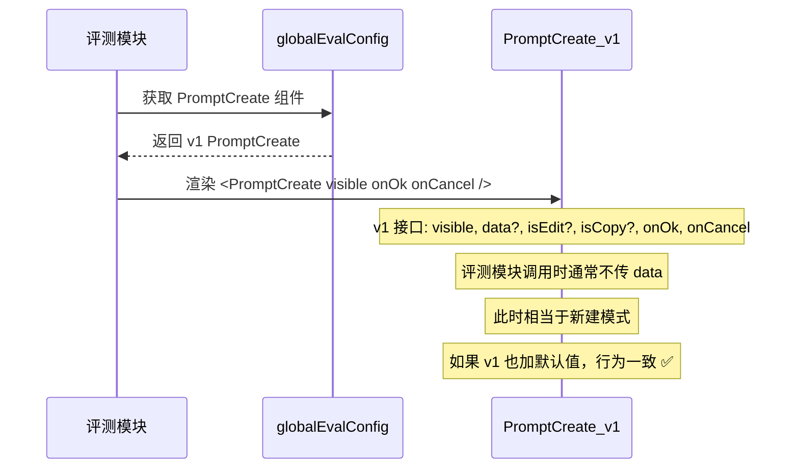

**隐性需求 M-16**：`evaluate-components` 中的全局配置通过 `setPromptCreate()` 方法允许外部替换 PromptCreate 组件。接口定义为 `{ visible, onCancel, onOk }`，不包含 `data`、`isEdit`、`isCopy` 等参数。这意味着评测模块中使用时始终是新建模式，如果修改了 v1 组件，默认值会自动生效。但需注意：如果外部通过 `setPromptCreate` 注入了自定义组件，该自定义组件不会自动获得默认值行为。

---

## 3. 需求汇总表

| 编号 | 需求描述 | 所属层级 | 重要程度 | 影响范围 |
|------|----------|----------|----------|----------|
| M-01 | 确认 Modal 关闭时是否卸载子组件，确保重新打开时 initValues 正确生效 | 页面生命周期 | 关键 | PromptCreateModal 所有使用场景 |
| M-02 | 明确页面刷新后 Modal 表单数据不恢复是可接受行为 | 页面生命周期 | 一般 | 文档记录 |
| M-03 | Modal 关闭后重新打开时表单值需重置为默认值，避免残留上次编辑数据 | 页面生命周期 | 重要 | PromptCreateModal |
| M-04 | Playground「快速创建」场景下 data 存在但 prompt_key 为空时的默认值行为 | 组件状态流转 | 关键 | prompt-header 快速创建流程 |
| M-05 | 列表页「复制→取消→创建」操作序列中 isCopyPrompt 状态正确重置 | 组件状态流转 | 重要 | prompt-pages/list |
| M-06 | v1（PromptCreate）与 v2（PromptCreateModal）组件默认值行为一致性 | 组件状态流转 | 重要 | evaluate-components、prompt-components |
| M-07 | 固定默认 Key 的唯一性冲突处理策略（Key 重复时的用户体验） | 用户交互动线 | 关键 | 所有创建场景 |
| M-08 | 提交失败后 Modal 保持打开、数据保留、错误信息友好展示 | 用户交互动线 | 重要 | PromptCreateModal |
| M-09 | Snippet 模式下默认值逻辑应跳过（Prompt Key 由代码自动生成） | 用户交互动线 | 一般 | isSnippet=true 场景 |
| M-10 | handleOk 中 API 调用缺少错误处理，需增加用户友好的错误提示 | 数据获取与缓存 | 关键 | PromptCreateModal |
| M-11 | 确认提交按钮的 loading 状态能有效防止重复提交 | 数据获取与缓存 | 一般 | PromptCreateModal |
| M-12 | 考虑是否增加 Prompt Key 异步唯一性校验（blur 时检查） | 数据获取与缓存 | 一般 | PromptCreateModal |
| M-13 | 双版本组件（v1/v2）的修改同步策略 | 组件复用与影响 | 关键 | prompt-components、prompt-components-v2 |
| M-14 | initValues 默认值兜底需使用 `\|\|` 而非 `??`，处理空字符串场景 | 组件复用与影响 | 重要 | PromptCreateModal initValues 计算 |
| M-15 | 默认值采用硬编码方案还是 Props 传入方案 | 组件复用与影响 | 一般 | PromptCreateModal 接口设计 |
| M-16 | evaluate 模块全局配置注入自定义组件时的默认值兼容性 | 组件复用与影响 | 一般 | evaluate-components |
