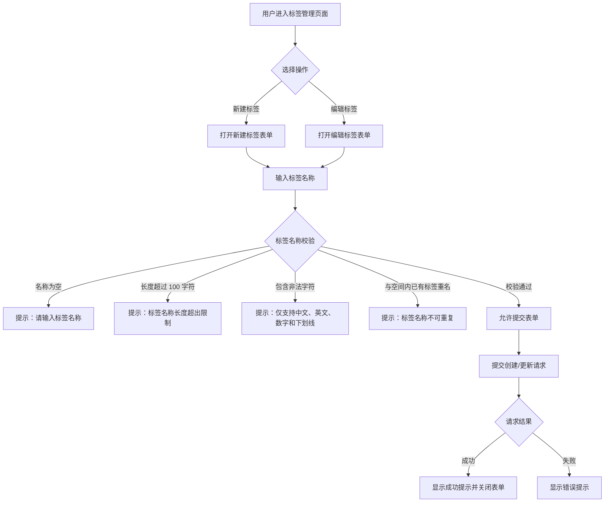

# 功能规格说明书：标签名称字符长度扩展

## 1. 概述

将标签管理功能中「新建标签」和「编辑标签」表单里的标签名称字符长度上限从当前值扩展到 **100**，最小长度保持 **1**。

> **PRD 范围说明**：PRD 原文明确的功能范围为「新建标签表单」，本规格基于一致性原则将「编辑标签」和「标签选项值名称」纳入同步变更范围，以避免同一数据模型出现不一致的校验规则。

## 2. 用户故事

| 编号 | 角色 | 故事 | 验收标准 |
|------|------|------|----------|
| US-001 | 标签管理员 | 我希望在新建标签时，标签名称可以输入最多 100 个字符，以便为标签提供更具描述性的命名 | 标签名称输入框允许 1～100 个字符 |
| US-002 | 标签管理员 | 我希望在编辑标签时，标签名称同样支持最多 100 个字符，与新建规则保持一致 | 编辑标签时名称输入框允许 1～100 个字符 |
| US-003 | 标签管理员 | 我希望在输入不合法长度时收到明确的错误提示，以便我知道如何修正 | 空值或超过 100 字符时显示长度校验错误信息 |

## 3. 交互流程



## 4. 验收场景

```markmap
# 标签名称长度扩展验收

## 新建标签
### 正常输入
- 输入 1 个字符 → 校验通过
- 输入 50 个字符 → 校验通过
- 输入 100 个字符 → 校验通过
- 输入中文、英文、数字、下划线混合 → 校验通过

### 边界校验
- 不输入任何字符 → 提示长度错误
- 输入 101 个字符 → 输入框阻止输入（maxLength 限制）
- 输入超过 100 字符后粘贴 → 截断至 100 字符

### 字符校验
- 输入特殊字符（@#$%） → 提示字符不合法
- 输入空格 → 提示字符不合法

### 唯一性校验
- 输入与已有标签相同名称 → 提示名称重复

## 编辑标签
### 正常编辑
- 将已有标签名称修改为 100 字符以内 → 校验通过
- 保持原名称不变 → 校验通过

### 边界校验
- 清空名称 → 提示长度错误
- 修改为 101 字符 → 输入框阻止输入

## 标签选项值名称
### 分类型标签选项
- 选项值名称输入 1～100 字符 → 校验通过
- 选项值名称超过 100 字符 → 输入框阻止输入

### 布尔型标签选项
- 选项值名称输入 1～100 字符 → 校验通过
- 选项值名称超过 100 字符 → 输入框阻止输入
```

## 5. 功能需求

### FR-001 标签名称最大长度扩展

**描述**：将标签名称的字符长度上限扩展到 100。最小长度保持 1 个字符不变。

**验收标准**：
- 常量 `MAX_TAG_NAME_LENGTH` 值变更为 100
- 标签名称允许输入 1～100 个字符
- 输入 100 个字符时可正常创建/保存标签
- 原上限至 100 字符范围内的名称不再被拦截

---

### FR-002 标签名称输入框前端截断限制

**描述**：新建标签和编辑标签表单中，标签名称输入框（`tag_key_name` 字段）的前端输入上限同步调整为 100 个字符，阻止用户输入超长内容。

**验收标准**：
- 标签名称输入框 `maxLength` 属性设置为 100
- 通过键盘输入第 101 个字符时被阻止
- 通过粘贴超长内容时，由浏览器原生 `maxLength` 属性自动截断至 100 个字符（保留前 100 个字符）
- 新建和编辑两种入口行为一致

---

### FR-003 标签名称校验规则更新

**描述**：标签名称校验函数的长度判断条件同步更新，当名称为空或超过 100 个字符时返回错误提示。

**前置条件**：
- 字符合法性规则不变：仅允许中文、英文字母、数字、下划线
- 空间内唯一性校验逻辑不变

**验收标准**：
- 名称为空时提示错误
- 名称长度 1～100 时校验通过
- 名称长度 > 100 时提示长度超出限制

---

### FR-004 标签选项值名称长度同步扩展

**描述**：分类型（Categorical）和布尔型（Boolean）标签的选项值名称输入框的 `maxLength` 同步调整为 100，保持与标签名称长度规则一致。

**验收标准**：
- 分类型标签选项值输入框 `maxLength=100`
- 布尔型标签选项值输入框 `maxLength=100`
- 选项值名称校验复用 `tagNameValidate` 函数，自动适用新长度规则

---

### FR-005 错误提示文案准确性

**描述**：长度校验失败时的错误提示文案需准确反映新的长度限制（100 个字符），不应仍显示旧限制值。

**校验场景与提示文案**：

| 校验场景 | 错误提示文案 | 备注 |
|----------|-------------|------|
| 名称为空 | 请输入标签名称 | 交互流程图中已体现 |
| 长度超过 100 字符 | 标签名称长度超出限制 | 交互流程图中已体现 |
| 包含非法字符 | 仅支持中文、英文、数字和下划线 | 交互流程图中已体现 |
| 与已有标签重名 | 标签名称不可重复 | 交互流程图中已体现 |

**验收标准**：
- 国际化文案 `tag_name_length_limit` 中若包含具体数字，需更新为 100 [待澄清: 当前 i18n 文案是否包含具体数字需确认，若为通用文案则无需修改]
- 上述四类校验场景的提示文案与交互流程图一致

## 6. 业务逻辑规则

| 编号 | 规则名称 | 描述 |
|------|----------|------|
| BL-001 | 标签名称长度范围 | 标签名称最小 1 个字符，最大 100 个字符 |
| BL-002 | 标签名称合法字符 | 仅允许中文（\u4e00-\u9fa5）、英文字母（a-zA-Z）、数字（0-9）、下划线（_） |
| BL-003 | 标签名称空间唯一性 | 同一工作空间内标签名称不可重复（排除当前编辑的标签自身） |
| BL-004 | 标签选项值名称规则 | 选项值名称复用标签名称校验规则（长度、字符、选项内唯一性） |
| BL-005 | 描述长度限制 | 标签描述最大 200 个字符（不变） |
| BL-006 | 字符计数方式 | 字符长度以 JavaScript `String.length`（UTF-16 code unit）计算；由于合法字符集限制为中英文、数字、下划线（BL-002），不存在代理对（surrogate pair）导致的计数偏差 |
| BL-007 | 前后空格处理 | 标签名称的前后空格应在提交前进行 trim 处理；空格不属于合法字符（BL-002），输入时即应被字符校验拦截 |

## 7. 表单规格

### 新建/编辑标签表单

| 字段名 | 字段标识 | 类型 | 必填 | 校验规则 | 备注 |
|--------|----------|------|------|----------|------|
| 标签名称 | tag_key_name | 文本输入 | 是 | 1～100 字符；仅中英文、数字、下划线；空间内唯一 | maxLength=100 |
| 描述 | description | 多行文本 | 否 | 最大 200 字符 | maxLength=200, maxCount=200（不变） |
| 标签类型 | content_type | 下拉选择 | 是 | 必须选择一项 | 编辑模式下禁用（不变） |
| 标签选项值名称 | tag_values[n].tag_value_name | 文本输入 | 否 | 1～100 字符；仅中英文、数字、下划线；选项内唯一 | maxLength=100；仅分类型/布尔型显示 |

## 8. 影响范围

- **新建标签页面**（TagsCreatePage）
- **标签表单弹窗**（useTagFormModal → 新建/编辑模式）
- **标签表单组件**（TagsForm）
- **常量定义**（MAX_TAG_NAME_LENGTH）
- **校验函数**（tagNameValidate）
- **国际化文案**（tag_name_length_limit，视文案内容决定是否需要更新）

## 9. 不在范围内

- 标签描述的长度限制不变（保持 200 字符）
- 标签选项数量上限不变（由 tagSpec.max_total 控制）
- 标签类型选项不变
- 后端 API 的校验规则变更不在本前端规格范围内
- 标签名称字符合法性规则不变
