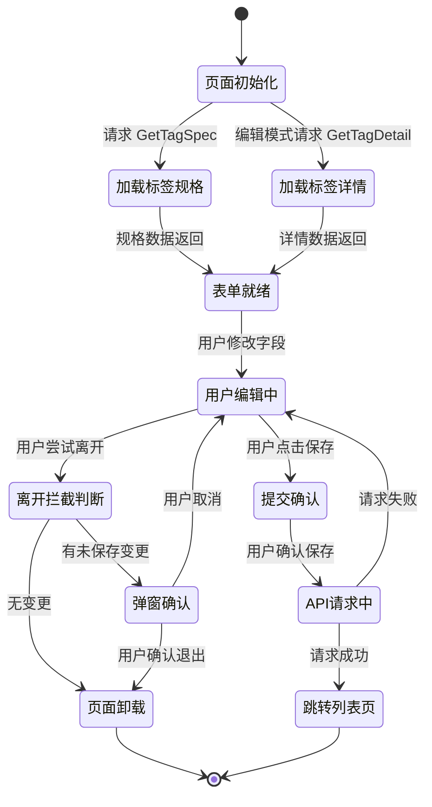
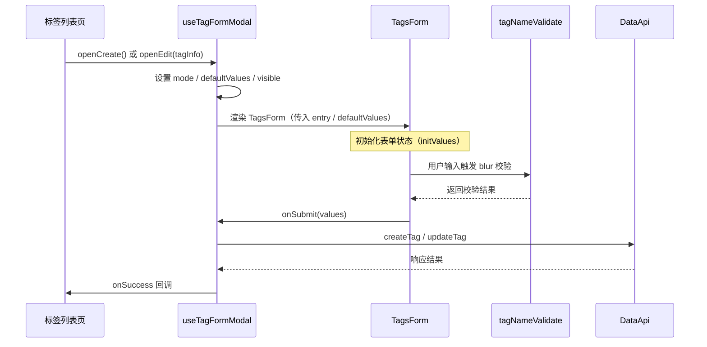
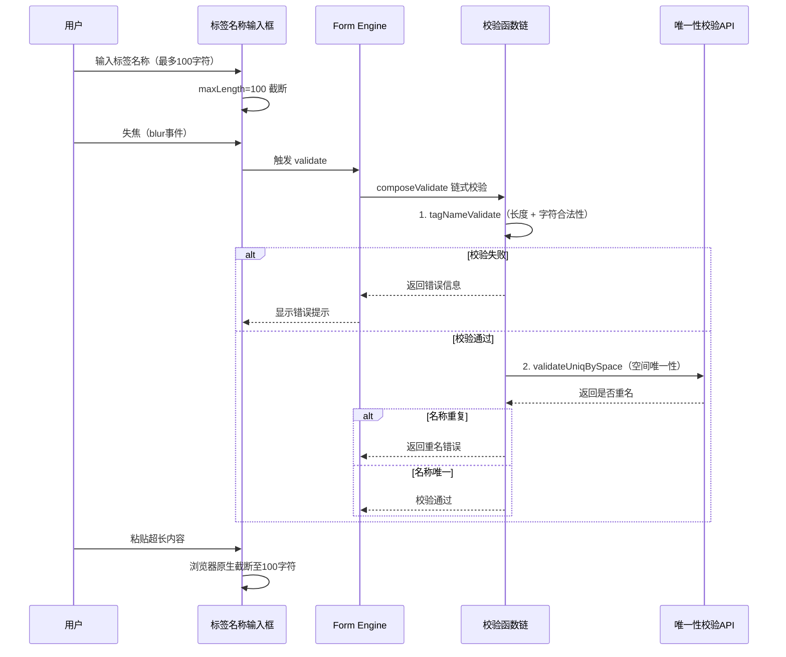
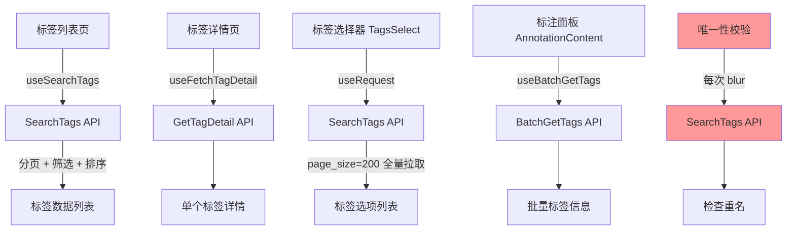
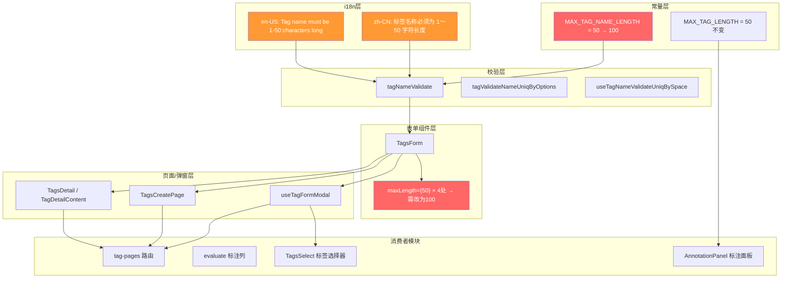

# 前端隐性技术需求分析报告

## 1. 分析概览

**需求背景**：将标签名称字符长度上限从 50 扩展到 100，涉及常量、校验函数、表单组件、i18n 文案等多处变更。

**分析范围**：
- 核心包：`@cozeloop/tag-components`（标签管理组件库）
- 上游消费者：`tag-pages`（路由页面）、`evaluate` 模块（标注列关联）、`observation-adapter`
- 关键文件：`TagsForm` 组件、`tagNameValidate` 校验函数、常量定义文件、i18n 文案文件

**关键发现**：代码中存在 **两个独立常量** `MAX_TAG_LENGTH`（标签选项数量上限）和 `MAX_TAG_NAME_LENGTH`（标签名称长度上限），且它们当前值均为 50，极易混淆。此外，`TagsForm` 组件中存在 **4 处硬编码 `maxLength={50}`**，与常量定义脱节。

---

## 2. 分层分析结果

### 2.1 页面生命周期分析

**挖掘到的隐性需求：**

1. **编辑模式下旧数据回显兼容**：编辑已有标签时，`defaultValues` 从后端获取并回填表单。如果后端已存储的标签名长度在旧上限（50）范围内，扩展到 100 后不会有问题。但需确认：当后端还未同步放宽到 100 时，前端提交 51～100 字符的名称是否会被后端拒绝，导致前后端校验不一致。

2. **页面刷新恢复**：`TagsDetail` 页面通过 URL 中的 `tagId` 参数重新拉取详情，表单数据不依赖内存状态。但 `TagsCreatePage` 不持久化草稿，刷新后用户已输入的长标签名（50～100 字符）会丢失，用户需重新输入。需评估是否需要增加草稿暂存机制。

3. **变更检测精度**：`TagsDetail` 使用 `isEqual` 深比较当前表单值与原始值来判断是否有变更。标签名长度扩展后，更长的名称对比计算量增加微乎其微，但要确保 `formatTagDetailToFormValues` 中转换逻辑与表单初始值完全一致，否则可能导致误判为"有变更"。

### 2.2 组件状态流转分析

**挖掘到的隐性需求：**

1. **`MAX_TAG_LENGTH` 与 `MAX_TAG_NAME_LENGTH` 语义混淆** ⭐：常量文件中定义了两个常量——`MAX_TAG_LENGTH = 50`（标签选项数量上限，用于 `AnnotationContent` 中标注面板限制标注数量）和 `MAX_TAG_NAME_LENGTH = 50`（标签名称长度上限，用于校验函数）。当前二者值相同为 50，修改时极易误改 `MAX_TAG_LENGTH`，导致标签选项数量上限被意外变更。必须明确区分两个常量的用途，只修改 `MAX_TAG_NAME_LENGTH` 为 100。

2. **表单组件硬编码 `maxLength={50}`**：`TagsForm` 组件中有 **4 处** `maxLength={50}` 硬编码（标签名称输入框 1 处、分类型选项值输入框 1 处、布尔型选项值输入框 2 处），未引用 `MAX_TAG_NAME_LENGTH` 常量。这些硬编码值必须同步修改为 100，否则会出现校验函数允许 100 字符但输入框在 50 字符时截断的不一致行为。

3. **`useTagFormModal` 中 Modal 固定高度**：弹窗 Hook 设置了 `height={640}`，当标签名从 50 字符扩展到 100 字符后，错误提示文案可能变长，加上更长的输入内容需要更多横向空间。需验证弹窗内表单在长名称场景下的布局是否溢出。

4. **表单 `onChange` 与 `onValueChange` 双回调**：`TagsForm` 同时暴露 `onChange`（表单整体状态变更）和 `onValueChange`（表单值变更）两个回调。`TagsDetail` 页面依赖 `onValueChange` 判断变更状态，而 `useTagFormModal` 依赖 `onChange`。扩展长度后需确保两个回调在长文本输入场景下的触发时机和频率不受影响。

### 2.3 用户交互动线分析

**挖掘到的隐性需求：**

1. **唯一性校验的网络延迟**：`useTagNameValidateUniqBySpace` 在每次 blur 时发起异步 API 请求（`SearchTags`），检查名称是否在空间内重复。标签名扩展到 100 字符后，如果用户在长名称上频繁编辑并失焦，会产生大量校验请求。当前实现没有防抖/取消机制，可能导致：旧的校验请求晚于新请求返回，覆盖正确的校验结果（竞态问题）。

2. **分类型选项值的联动校验**：分类型标签中，每个选项值输入框的 `onChange` 会触发整个 `tag_values` 数组的重新校验。当选项值名称也扩展到 100 字符后，多个选项同时修改可能引发校验风暴（N 个选项 × N 次校验），影响用户体验。

3. **粘贴行为的字符截断**：依赖浏览器原生 `maxLength` 属性进行截断。对于中英文混合内容，截断位置可能在视觉上不理想（如截断在中文字符中间，虽然 UTF-16 不会真的截断中文，但前 100 个 code unit 可能不是用户期望的截断点）。需考虑是否需要自定义截断逻辑以提供更友好的用户体验。

4. **表单提交前的 trim 处理**：规格文档 BL-007 要求提交前对标签名称进行 trim 处理。但当前 `tagNameValidate` 在输入时即校验，空格会被字符合法性规则拦截，无法输入。需确认前后端对空格的处理逻辑一致——如果后端允许前后空格，前端截断后可能导致有效字符不足 100。

### 2.4 数据获取与缓存分析

**挖掘到的隐性需求：**

1. **唯一性校验的重复请求**：每次标签名输入框 blur 都会调用 `SearchTags` API 进行唯一性校验，没有缓存机制。如果用户在同一个名称上多次失焦（如点击其他字段再回来），会重复发送相同的请求。建议考虑：对相同名称的校验结果做短期缓存，或者对校验请求做去重。

2. **`TagsSelect` 全量拉取标签**：`TagsSelect` 组件固定以 `page_size=200` 拉取所有标签。标签名扩展到 100 字符后，每条标签的数据量增大，200 条标签的响应体积会有所增长。当前实现没有分页加载或虚拟滚动，大量标签时可能影响下拉框渲染性能。

3. **标签列表页搜索参数持久化**：`useSearchTags` 将搜索参数同步到 URL 的 searchParams。标签名更长后，如果搜索关键字也变长，URL 长度可能增加，但一般不会超过浏览器限制。不过需注意 `tag_key_name_like` 参数的模糊搜索在后端的性能表现。

4. **弱网场景下的校验超时**：唯一性校验通过异步 API 实现，当前校验函数捕获异常后返回空字符串（视为校验通过）。这意味着弱网或 API 超时时，重名的标签名可能通过前端校验，最终由后端拦截。这是现有行为，扩展长度后风险不变但值得记录。

### 2.5 组件复用与影响分析 ⭐

**挖掘到的隐性需求：**

1. **i18n 文案包含硬编码数字** ⭐⭐⭐：`tag_name_length_limit` 的中文文案为 `"标签名称必须为 1～50 字符长度"`，英文文案为 `"Tag name must be 1-50 characters long"`。文案中直接硬编码了 `50`，必须同步修改为 `100`。如果遗漏，用户会看到与实际限制不一致的错误提示。建议评估是否改为参数化文案（如 `标签名称必须为 1～{max} 字符长度`），以避免后续再次修改时遗漏。

2. **`TagsForm` 组件的 Props 兼容性**：`TagsForm` 接收 `maxTags` prop 控制标签选项数量上限（默认值为 `MAX_TAG_LENGTH`），这个参数与标签名称长度无关。修改时需确保不混淆 `maxTags`（选项数量限制）与标签名称长度限制。当前 `TagsForm` 没有 `maxNameLength` prop，长度限制完全由内部硬编码和校验函数控制。如果要提升灵活性，可考虑将标签名称最大长度也作为 prop 传入。

3. **`AnnotationContent` 中的 `MAX_TAG_LENGTH` 使用**：标注面板中使用 `MAX_TAG_LENGTH`（值为 50）限制标注数量（`disabled={formState.values?.tags?.length >= MAX_TAG_LENGTH}`）。此常量与标签名称长度无关，但因命名相似，代码审查时容易被误改。需特别标注此处不应修改。

4. **`evaluate` 模块的间接依赖**：`evaluate` 模块中的 `annotate-item.tsx` 导入了 `TAG_TYPE_TO_NAME_MAP`（标签类型名称映射），与标签名称长度无关。但该组件展示标签名称时使用了 `TypographyText` 进行文本溢出处理。标签名扩展到 100 字符后，标注列中的标签名展示可能需要调整溢出省略策略，确保长名称在有限空间内合理展示。

5. **`TagsItem` 组件的显示适配**：标签列表和选择器中使用 `TagsItem` 组件展示标签信息。标签名从最长 50 字符扩展到 100 字符后，列表中的标签名称展示区域是否足够？是否需要调整文本溢出截断（ellipsis）策略？需在列表、选择器、详情页三个场景中验证长名称的 UI 表现。

6. **标签详情页标题区域**：`TagsDetail` 页面使用 `useBreadcrumb` 将标签名设为面包屑文本。100 字符的标签名作为面包屑可能导致导航栏溢出。需确认面包屑组件对长文本的处理能力。

---

## 3. 需求汇总表

| 编号 | 需求描述 | 所属层级 | 重要程度 | 影响范围 |
|------|----------|----------|----------|----------|
| M-001 | i18n 文案 `tag_name_length_limit` 中硬编码了 "50"，必须更新为 "100"（中英文双语） | 第五层 组件复用 | 🔴 关键 | 校验提示文案，影响所有使用标签表单的场景 |
| M-002 | `TagsForm` 组件中 4 处 `maxLength={50}` 硬编码，必须同步修改为 100 | 第二层 状态流转 | 🔴 关键 | 标签名称、分类型选项值、布尔型选项值输入框 |
| M-003 | `MAX_TAG_LENGTH`（选项数量）与 `MAX_TAG_NAME_LENGTH`（名称长度）易混淆，需明确区分仅改后者 | 第五层 组件复用 | 🔴 关键 | 常量引用的所有位置（校验函数 + 标注面板） |
| M-004 | 唯一性校验（blur 触发）无防抖/竞态控制，长名称编辑场景下可能产生多余请求和竞态 | 第三层 用户交互 | 🟡 重要 | 新建/编辑标签表单 |
| M-005 | 标签名扩展后，列表/选择器/面包屑中长名称显示需验证溢出截断策略 | 第五层 组件复用 | 🟡 重要 | TagsItem、TagsSelect、面包屑、evaluate 标注列 |
| M-006 | `useTagFormModal` 弹窗固定高度 640px，需验证长名称+错误提示场景的布局适配 | 第二层 状态流转 | 🟡 重要 | 弹窗模式的新建/编辑标签 |
| M-007 | 分类型选项值 onChange 联动校验可能引发校验风暴（N选项 × N次校验） | 第三层 用户交互 | 🟡 重要 | 分类型标签编辑表单 |
| M-008 | 前后端校验一致性：需确认后端 API 已同步将标签名长度上限放宽至 100 | 第一层 生命周期 | 🟡 重要 | 整体提交流程 |
| M-009 | `TagsForm` 未将 `maxNameLength` 外部化为 prop，灵活性不足 | 第五层 组件复用 | 🟢 一般 | TagsForm 组件接口设计 |
| M-010 | 唯一性校验异常静默通过（catch 返回空），弱网下可能放过重名 | 第四层 数据获取 | 🟢 一般 | 校验可靠性 |
| M-011 | `TagsCreatePage` 无草稿暂存，刷新后长标签名丢失 | 第一层 生命周期 | 🟢 一般 | 新建标签页面 |
| M-012 | i18n 文案建议参数化（如 `1～{max} 字符`），避免后续修改遗漏 | 第五层 组件复用 | 🟢 一般 | 国际化文案维护性 |
| M-013 | `TagsSelect` 全量拉取 200 条标签，标签名变长后响应体积增大 | 第四层 数据获取 | 🟢 一般 | 标签选择器性能 |
